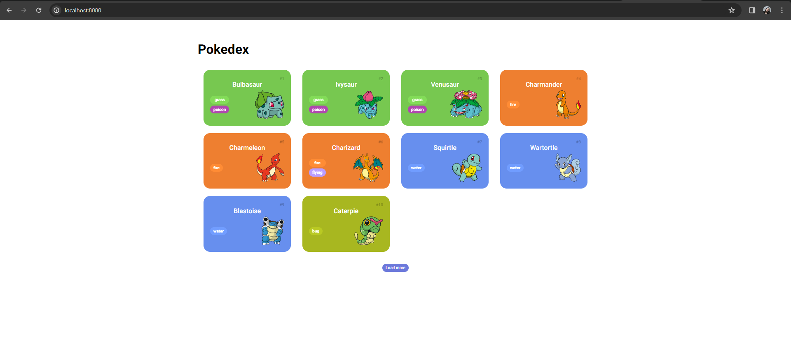
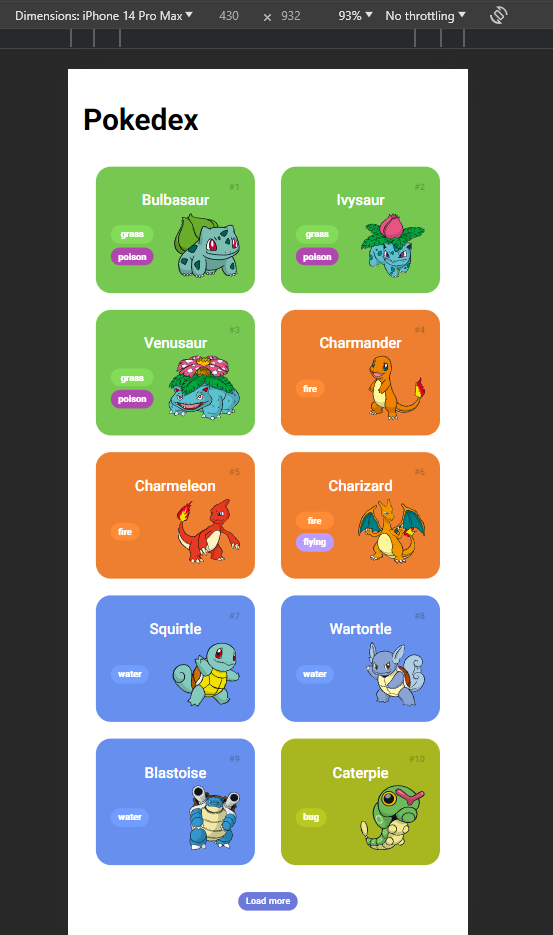
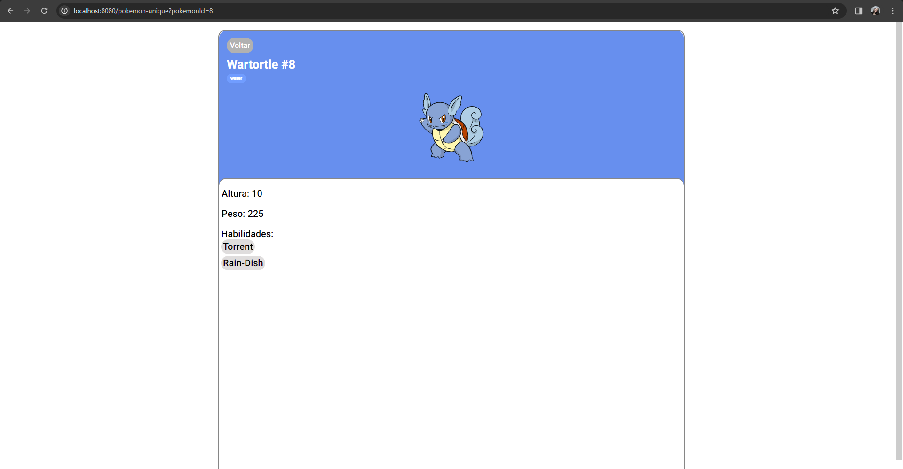
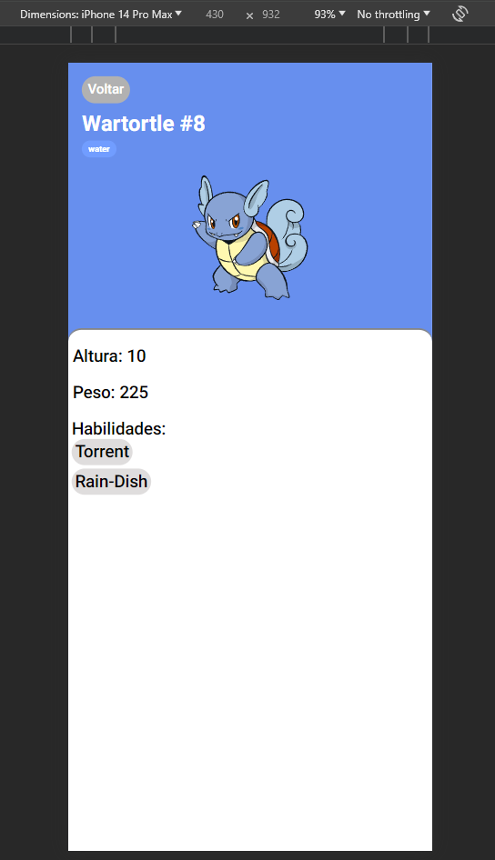

# POKEDEX

Projeto realizado utilizando conhecimento dos cursos "Criando um Projeto com HTML/CSS para Listagem de Pokémon" e "Dominando o Protocolo HTTP e Integrando com a PokeAPI" do Bootcamp "Desenvolvimento Frontend com Angular" da DIO. Foram consumidos endpoints para visualização de lista de pokemons e detalhes de um pokemon específico. O professor Renan [Github: RenanJPaula](https://github.com/RenanJPaula/RenanJPaula) nos ensinou a fazer requisições utilizando JavaScript e construímos juntos a primeira página que lista todos os pokemons da primeira geração. A segunda página, que mostra dados de um único pokemon, foi elaborada individualmente para o desafio "Construindo uma Pokédex com JavaScript".

##### GitHub do Projeto original: [js-developer-pokedex](https://github.com/digitalinnovationone/js-developer-pokedex)

##### Site API utilizada: [PokeAPI](https://pokeapi.co/)

## Página de listagem de Pokemons

#### Web

#### Mobile

## Página de detalhes Pokemon

#### Web

#### Mobile

